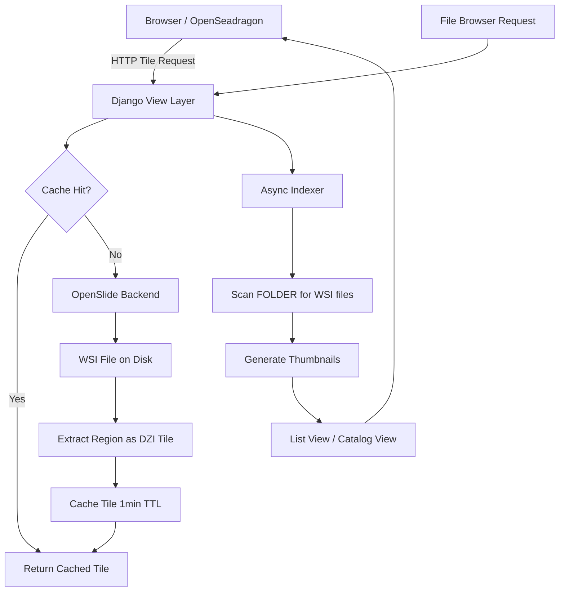
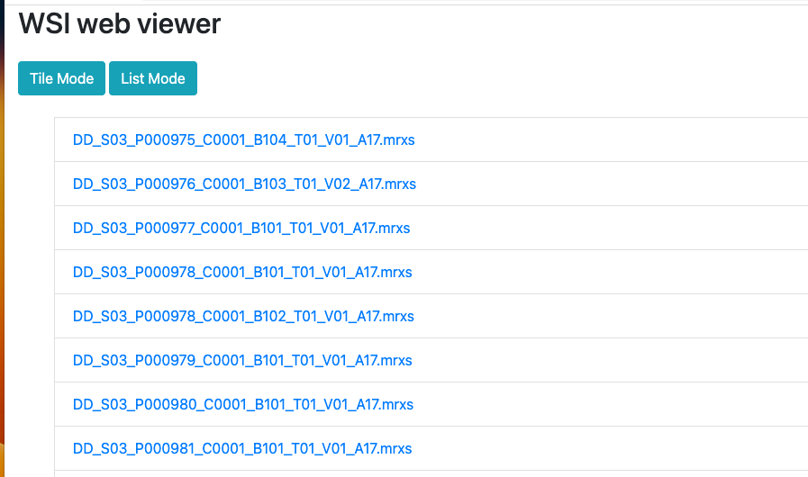
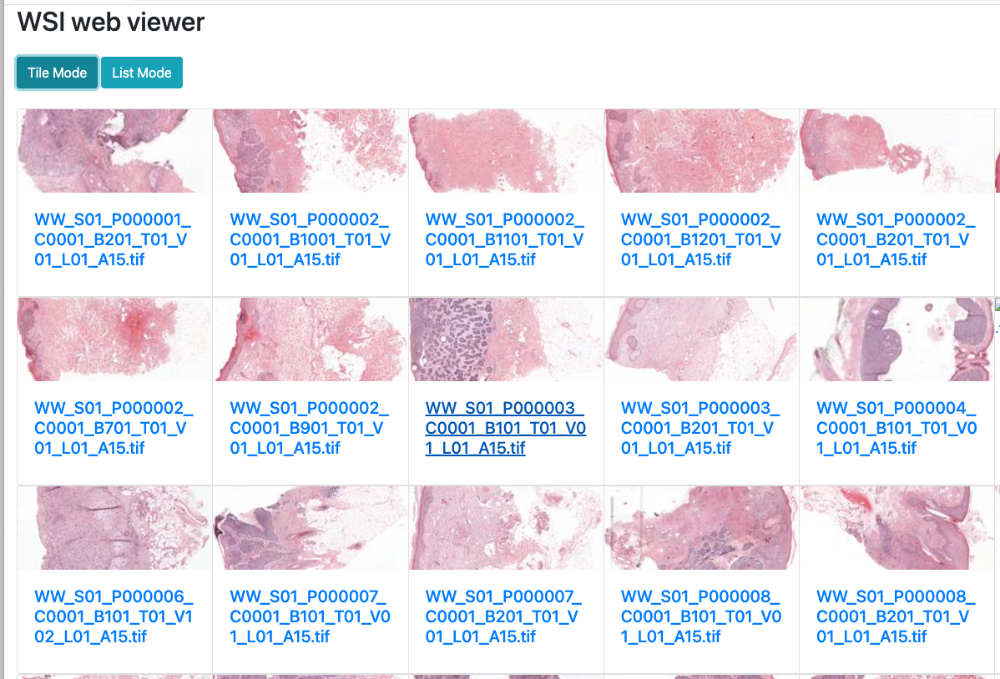
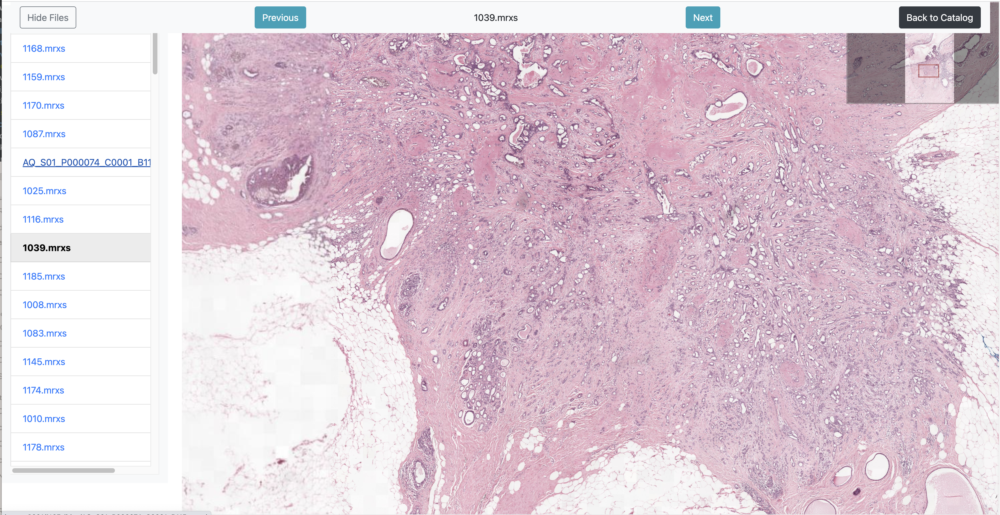

# SlideScope

---

A high-performance Django web application for viewing and navigating pathology whole-slide images (WSI) directly in your browser — powered by OpenSlide and OpenSeadragon.

---

**SlideScope** is a production-grade **Pathology Image Viewer** that brings clinical-quality whole-slide image exploration to any browser. Built with Django and containerized with Docker, it converts WSI files on-the-fly to the Deep Zoom Image (DZI) format, enabling lightning-fast tile streaming, smooth zoom, and effortless navigation — no proprietary software needed.

---

## ✨ Key Features

- 🔬 **Multi-format WSI Support** — Leverages OpenSlide to support SVS, NDPI, SCN, MRXS, TIFF, and more
- ⚡ **On-the-fly DZI Tile Streaming** — Real-time tile generation with aggressive 1-minute caching for snappy performance
- 🗂️ **Dual Browsing Modes** — Switch between a **List view** and a **Tile Catalog** view with thumbnail previews
- 🖼️ **OpenSeadragon Viewer** — Smooth, hardware-accelerated pan and zoom directly in the browser
- 🔄 **Lazy Loading** — Thumbnails load on demand as you scroll, keeping the UI fast even for large slide collections
- ⚙️ **Async Background Indexing** — Non-blocking slide indexing keeps the interface responsive at all times
- 🐳 **Docker-First Deployment** — Single Makefile command spins up the entire stack

---

## 🏗️ System Architecture



---

## 🛠️ Tech Stack

| Layer | Technology |
|---|---|
| **Backend Framework** | Django 4.x (Python 3.x) |
| **WSI Processing** | OpenSlide (multi-format WSI decoder) |
| **Tile Format** | Deep Zoom Image (DZI) |
| **Frontend Viewer** | OpenSeadragon |
| **Caching** | Django in-memory cache (1 min TTL) |
| **Async Processing** | Django background thread indexing |
| **Containerization** | Docker + Docker Compose |
| **Build Automation** | GNU Makefile |
| **Supported WSI Formats** | SVS, NDPI, SCN, MRXS, TIFF, VMS, VMU, BIF |

---

> [!NOTE]
> **Why DZI?** The Deep Zoom Image format divides a gigapixel whole-slide image into a pyramid of small tiles at multiple zoom levels. This means the browser never downloads the full image — only the visible tiles at the current zoom level are streamed, keeping memory usage minimal and performance buttery smooth even for 10GB+ slide files.

---

## 📋 Prerequisites

Before you begin, ensure you have installed:

- [Docker](https://www.docker.com/get-started)
- [Docker Compose](https://docs.docker.com/compose/install/)

---

## 🚀 Running the Application

**1. Clone the repository:**

```bash
git clone https://github.com/RishavJ7/simple-wsi-viewer.git
cd simple-wsi-viewer
```

**2. Start the server pointing to your WSI image folder:**

```bash
make runserver FOLDER=/path/to/your/imagefolder
```

This single command will:
- Build the Docker image with all OpenSlide dependencies
- Start the Django application inside a container
- Mount your image folder into the container
- Serve the viewer at **[http://localhost:8000](http://localhost:8000)**

---

## 📸 Screenshots

### 📋 List View — Browse your slide collection


### 🗂️ Catalog View — Visual tile thumbnails


### 🔬 Viewer — Pan, zoom and inspect slides


---

## 📁 Project Structure

```
simple-wsi-viewer/
├── Dockerfile              # Multi-stage Docker build with OpenSlide
├── docker-compose.yml      # Service orchestration
├── Makefile                # One-command build & run
├── manage.py               # Django entry point
├── requirements.txt        # Python dependencies
├── wsi_viewer/             # Django project settings & routing
│   ├── settings.py
│   └── urls.py
├── viewer/                 # Core Django app
│   ├── views.py            # Tile streaming, file listing, catalog views
│   ├── urls.py
│   ├── templates/          # HTML templates (base, list, catalog, viewer)
│   └── static/             # CSS and JavaScript assets
└── examples/               # Screenshot assets for documentation
```

---

## ⚙️ Configuration

| Variable | Default | Description |
|---|---|---|
| `FOLDER` | Required | Absolute path to your WSI image directory |
| `ALLOWED_HOSTS` | `*` | Django allowed hosts (agnostic by default) |
| Cache TTL | 60 seconds | Tile cache expiry (configurable in `settings.py`) |

---

## 📦 Dependencies

```
openslide-python
Django
```

All system-level dependencies (libOpenSlide, libtiff, libjpeg, etc.) are handled inside the Docker image.

---

## 👤 Author

**Rishav Raj**

[](mailto:rishav2004.work@gmail.com)
[](https://github.com/RishavJ7)
[](https://linkedin.com/in/rishavraj)
